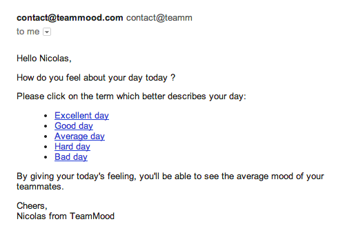
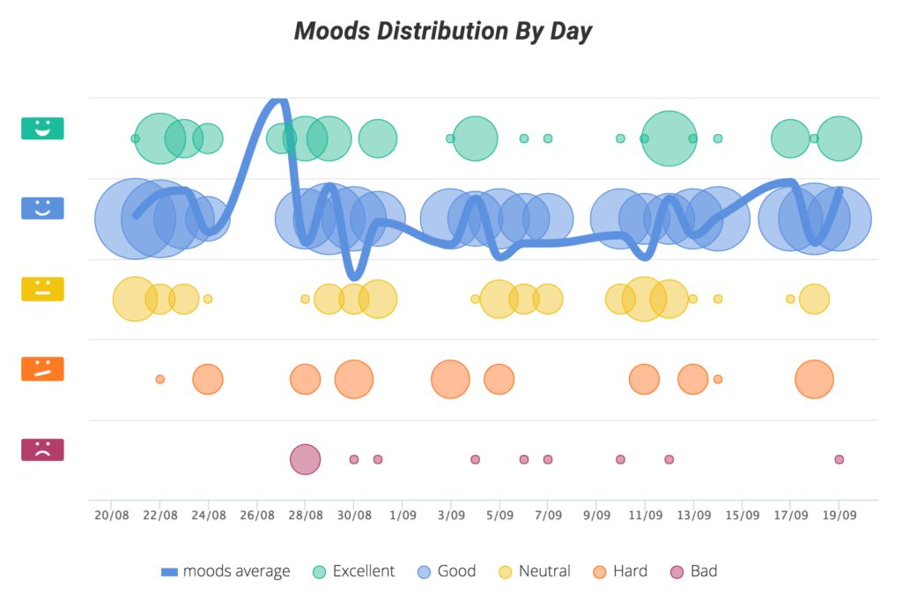

Mood Indicator Tool & Mood Meter Charts

---

# Team Mood

Team Mood is a Agile tool for detecting mood of your team member. Obviously, it's not
for coders only.

## Daily Mail

Each day, your team members receive one and only one ail and can respond to it.
Access can be filtered by SSO or other tools.

They show their mood and this is anonymized. One mail a day keeps your turnover away.

