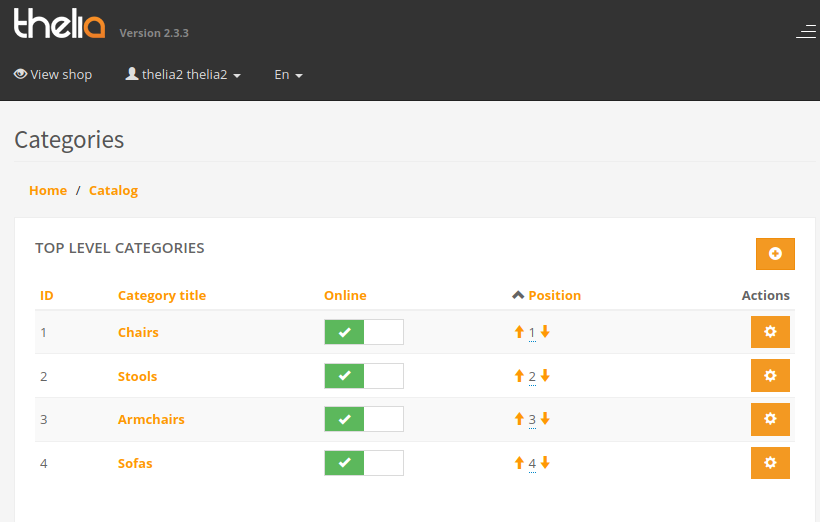

Thelia is a fully featured Ecommerce application

---

Thelia is a deluxe for developers. Based on Symfony with CQRS, it's easy to extend
the existing features by extending or adding events throws to the system.

It includes an excellent, simple, yet rich CMS platform. However, dealing with internationalization 
is more complex.  

