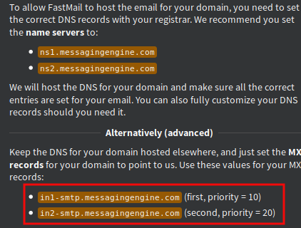
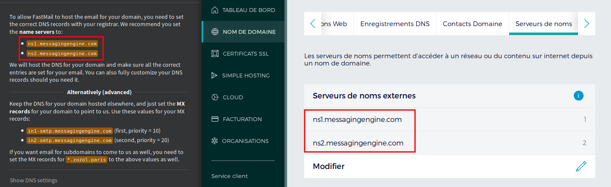
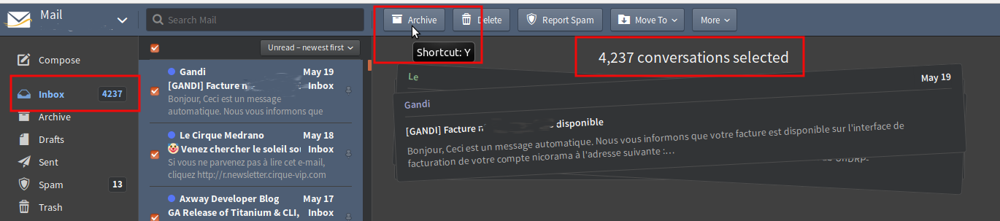

GMail was a revolution in 2004. Is Google too big now ?

---

Leaving Gmail
====

Why ?
----

Thousands of blog post have their opinion, here is mine.

Giving your data to Google was acceptable some time ago. It's not anymore. First because Google has changed, being so big. Second, and mostly important,
because if you think Google is still acceptable, it may not be tomorrow. Be prepared.

Today and tomorrow, an email address will represent your identity. Own it.

Registrar
---

First is to choose a registrar for your domain, like the excellent [http://www.gandi.net].
 Choose a domain name, such as `yourname.co.uk` if it's available and if you are britain.
If you are linked to the city and have 45€/y, choosing `yourname.paris` is a sexy option. But `yourname.me` is the most regular way and quite cheaper.

Then create a Fastmail (or ProtonMail or whatever that is not hotmail) account. The first real problem is that you must change the DNS settings
, so that when a mail arrive to `yourname.me`, your registrar can send it back to fastmail.
 
You can't buy directly a domain with Fastmail. But if you are no more agree with Fastmail, it will extremely simple to move and keep the same identity.   

I'm an advanced user, so I preferred to use the advanced option and use MX records for Fastmail, keeping other records for me, especially for the associated website.

DNS records are very hard to understand, but fortunately, the MX records that handle email redirection are not the worst. 
The main problem is that you must wait hours before knowing if the dns record is good or not. And `hours` is not precise enough.

The other problem is that I had to create email box on Gandi, then the MX would redirect to Fastmail. And emails are limited to two. It's not Gandi's Job.

So the standard way is better. Let say to Gandi that the serveur name is not on Gandi's IP but Fastmail IP.

Import emails
----

Then you must import all of your mail from Gmail. The main difficulty is to turn off Gmail security after these messages:

https://www.fastmail.com/help/account/gmailimport.html

>Critical security alert : A suspicious app was blocked from accessing your account

You must **temporarily** accept [Less secured Apps](https://myaccount.google.com/lesssecureapps) in your Google account

And don't forget to put security back after import. You should still keep your Google account safe.

Ooops
----

It looks like Gmail and Fastmail have not the same relationship with the **read** word. I had more than 4000 supposed 
unread messages. It's very easy to deal with that, but needs a bit of courage. Just archive them.

 

 

